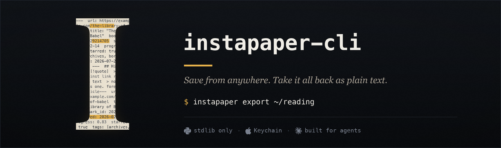

<div align="center">

<br><br>

[](https://www.python.org)
[](https://www.instapaper.com/developers)
[](AGENTS.md#testing)
[](#install)
[](LICENSE)

**Save, organise, and export your entire Instapaper library from the terminal — no dependencies, no password ever touching disk.**
</div>

Save URLs to your Instapaper inbox from the command line — and, if you want
more, export your library (bookmarks, highlights, notes, full article text) to
a folder of Markdown files. Python 3, stdlib only, no dependencies.

```sh
instapaper add "https://example.com/article"
saved: The Article's Real Title
```

Built to be driven by a coding agent (Claude Code, Cursor, etc.) as much as by
a human — so it takes no interactive input outside `login`, never puts a
password on the command line, and reports failure through exit codes. See
[AGENTS.md](AGENTS.md) if you're wiring it into an agent.

## Why this exists

Instapaper's [Simple API](https://www.instapaper.com/developers/v1/simple-api)
is a single endpoint. Existing wrappers are heavier than the thing they wrap —
the best-known one, [dakrone/ricepaper](https://github.com/dakrone/ricepaper),
is an unmaintained 2010-era Ruby gem that takes your password as a `-p` flag.
This started as roughly the same feature set in a single stdlib Python file,
with credentials pulled from the OS keychain instead.

It has since grown into a small package that also speaks Instapaper's
[Full API](https://www.instapaper.com/developers/v1/full-api) — OAuth 1.0a,
signed requests, the works — for the things the Simple API structurally cannot
do: folders and tags, listing and organising your library (star, move,
archive, delete), and pulling it (with highlights and notes) back out as
Markdown. The zero-setup path is untouched: if you never touch the Full-API
flags, this behaves exactly like v1.

## Install

Requires Python 3.8+. macOS for keychain-backed credentials; anything else
works via environment variables.

```sh
git clone https://github.com/gouthamganesan/instapaper-cli.git
cd instapaper-cli
chmod +x instapaper
ln -s "$PWD/instapaper" /usr/local/bin/instapaper   # or anywhere on your PATH
```

The `instapaper` file is a thin shim; the real code lives in the
`instapaper_cli/` package beside it. `git pull` is the whole upgrade story —
no install step, no virtualenv, no lockfile.

## Configure

### Username

Your Instapaper login. Instapaper usernames are usually, but not always, an
email address.

```sh
mkdir -p ~/.config/instapaper
echo -n 'you@example.com' > ~/.config/instapaper/username
```

Or set `INSTAPAPER_USERNAME`, which takes precedence.

### Password (Simple API + `login`)

Resolved in this order:

1. `INSTAPAPER_PASSWORD` environment variable, if set (including to an empty
   string). Use this on Linux, in CI, or in containers.
2. macOS Keychain, service `instapaper`, account matching your username.

```sh
security add-generic-password -s instapaper -a "you@example.com" -w
```

The `-w` flag prompts interactively, so the password never enters your shell
history. **Many Instapaper accounts have no password at all** — if yours is
one, store an empty string. The tool treats that as valid, not as missing.

Verify:

```sh
instapaper auth
simple API: ok (authenticated as you@example.com)
full API: not configured (run: instapaper login)
```

### Advanced setup: the Full API (OAuth)

This is optional. Skip it if `add` and `auth` are all you need. It unlocks
`--content`, `--folder`, `--tag`, `--archive`, `--description` on `add`, plus
the `export` command.

1. Register an app at
   [instapaper.com/developers/applications/create](https://www.instapaper.com/developers/applications/create).
   It starts in **Owner Only** mode, which works immediately against your own
   account — no emailed approval wait. You get a Consumer Key and a Consumer
   Secret.
2. Run:

   ```sh
   instapaper login --consumer-key <YOUR_CONSUMER_KEY>
   Instapaper OAuth consumer secret:      # hidden prompt (or set INSTAPAPER_CONSUMER_SECRET)
   logged in as you@example.com
   ```

   `login` does a one-time xAuth exchange: your account password (resolved
   the same way as above) is used once to obtain an OAuth token, then never
   touched again. The token is written to
   `~/.config/instapaper/credentials.json` at file mode `0600`.

That's it — `instapaper auth` now reports both layers, and the Full-API flags
on `add` and the `export` command work.

Per-field environment overrides exist if you'd rather not use the credentials
file (CI, containers): `INSTAPAPER_CONSUMER_KEY`, `INSTAPAPER_CONSUMER_SECRET`,
`INSTAPAPER_OAUTH_TOKEN`, `INSTAPAPER_OAUTH_SECRET`.

## Usage

### `add` — save URLs

```sh
# One URL
instapaper add "https://example.com/article"

# Several at once
instapaper add "https://a.com" "https://b.com" "https://c.com"

# With a custom title and a note (single URL only)
instapaper add "https://example.com" --title "Custom title" --selection "why I saved this"

# From a pipe or a file
cat urls.txt | instapaper add --stdin
pbpaste | instapaper add --stdin

# JSON output instead of human-readable lines
instapaper add "https://example.com" --json
```

By default `add` uses the zero-setup **Simple API** — identical to v1. It
automatically routes through the **Full API** instead, the moment you pass any
of `--content`, `--folder`, `--tag`, `--archive`, or `--description` (this
requires `login` first; see above). You don't choose the API explicitly, the
flags you use choose it for you:

```sh
# Simple API (default) — no login required
instapaper add "https://example.com"

# Full API (auto-routed) — needs `instapaper login` first
instapaper add "https://example.com" --folder starred --tag longread --archive
instapaper add "https://example.com" --description "for the reading list"

# --folder takes a display name, not just an id — resolved via folders/list
instapaper add "https://example.com" --folder "Reading List"

# ...and can create the folder on the way in if it doesn't exist yet
instapaper add "https://example.com" --folder "Board Games" --create-folder
```

`--folder` accepts a folder's **display name**, a numeric id, or one of the
system literals `unread` / `starred` / `archive`. A name is resolved to its id
via `folders/list`; an unknown name errors (and lists what does exist) unless
you pass `--create-folder`, which creates it first and then saves into it.
`--tag` is repeatable — `--tag a --tag b` attaches both.

`--title` and `--selection`/`--description` apply to a single URL. Passing
them alongside multiple URLs is rejected rather than silently applied to all
of them. Same rule for `--content` (below).

**Paywalled, login-gated, or Medium-style pages** — Instapaper's server-side
fetcher can't see past a login wall, and Medium in particular blocks it
outright. Two independent escape hatches, usable together or separately:

```sh
# Upload the page's own HTML instead of letting Instapaper re-fetch it
# (e.g. pull it from a browser extension, curl with your own cookies, etc.)
instapaper add "https://example.com/paywalled" --content page.html
cat page.html | instapaper add "https://example.com/paywalled" --content -

# Force-wrap through a Freedium-style mirror that de-paywalls Medium
instapaper add "https://medium.com/@x/some-post" --freedium
```

`--content` is Full-API only (it implies routing there) and single-URL only.
When `--content` is supplied, the URL is sent verbatim — it is *never*
Freedium-wrapped, so the bookmark's identity stays the real article URL, not a
mirror URL.

**Freedium auto-wrapping** happens even without `--content` or `--folder`:
any URL whose host matches an entry in the configured domain list (seeded with
`medium.com`, and its subdomains) gets silently rewritten to go through the
mirror — *if* freedium is turned on (`instapaper config freedium on`; off by
default). `--freedium` forces wrapping for this call regardless of config;
`--no-freedium` disables it for this call regardless of config. See
[Behaviour worth knowing](#behaviour-worth-knowing) for what wrapping actually
does to the saved bookmark.

**Exit codes:** `0` if every URL saved, `1` if any failed or if configuration
is missing. Per-URL failures print to stderr and do not abort the remaining
URLs. `--json` emits `{"saved": [...], "failed": [...]}` on stdout instead of
per-line text (still exit `1` on any failure). Each `saved` entry is
`{"bookmark_id", "url", "title", "folder_id"}` — the `bookmark_id` lets a
script move/tag/delete what it just saved without a follow-up `list` matched by
URL. It's populated on the **Full-API path** (any of `--content`/`--folder`/
`--tag`/`--archive`/`--description`); on the plain Simple-API path the API
returns no id, so `bookmark_id` and `folder_id` are `null`.

On success the tool prints the title Instapaper resolved server-side — from
`X-Instapaper-Title` on the Simple path, from the response body on the
Full-API path — which is a useful signal that the article actually parsed,
not just that the URL was accepted.

### `auth` — verify credentials

```sh
instapaper auth
```

Checks **both** layers independently: the Simple API's `authenticate`
endpoint, and — if OAuth credentials exist — the Full API's
`verify_credentials`. A missing Full-API login is reported, not treated as an
error; the command's exit code reflects the Simple-API result only, since
that's the layer everything else depends on.

### `list` — see what's in a folder

```sh
instapaper list                              # unread, oldest-first: date, id, title, tags
instapaper list --folder starred
instapaper list --folder "Reading List"       # by name, id, or unread/starred/archive
instapaper list --before 2026-06-01           # only saves older than a date
instapaper list --order newest                # newest-first, matching the app's display
instapaper list --json                        # bookmark_id, title, url, saved, time, starred, tags
```

Full-API only. This is how you find the **bookmark ids** the mutation verbs
below need — a starred bookmark is marked `*`, tags print as `#tag`, and the
stderr summary line reports the count. `--folder` resolves a display name the
same way `add` does. The JSON id field is `bookmark_id` — the same name
`export` frontmatter and the mutation verbs use, so a script written against
one works against all of them.

**Ordering:** `list` is **oldest-first** by default; the Instapaper app shows a
folder **newest-first**. That inversion is why "send the reading order in
reverse" used to be the only trick available — `--order newest` now gives you
the app's order directly, and `--order oldest` (the default) is the
chronological one. The two are exact reverses of the same fetched set.

### `archive` / `unarchive` — move bookmarks in and out of the Archive

```sh
instapaper archive 2029214705                 # one or more ids (immediate, reversible)
instapaper archive 2029214705 111 --json

instapaper archive --before 2026-06-01         # BULK: everything in --folder older than a date
instapaper archive --before 2026-06-01 --apply # dry run without --apply; --folder defaults to unread

instapaper unarchive 2029214705               # move back out of the Archive
```

`archive` has two modes: give explicit **ids** and it archives them immediately;
give `--before YYYY-MM-DD` and it bulk-archives everything in `--folder`
(default `unread`) older than that date — a **dry run** until you add `--apply`.
(This bulk workflow is what the old `tools/inbox.py archive` did, now folded in.)

### `star` / `unstar` / `move` — organise existing bookmarks

```sh
instapaper star 2029214705                    # star / unstar one or more ids
instapaper unstar 2029214705
instapaper move 2029214705 --folder "Reading List"       # move into a folder (by name or id)
instapaper move 2029214705 --folder "New Folder" --create-folder
```

`move` resolves `--folder` the same way `add` does (name, id, or literal) and
takes `--create-folder` to make the destination on the fly.

### `delete` — permanently remove bookmarks

```sh
instapaper delete 2029214705                  # refuses: permanent, needs --yes
instapaper delete 2029214705 111 --yes        # actually deletes (no undo)
```

`delete` is **permanent** — it destroys the bookmark and its highlights — so it
will not run without `--yes`. Prefer `archive` when you just want it out of your
unread queue. Across all these verbs each id is processed independently: a
per-id failure is reported and does **not** abort the rest, and any failure
flips the exit code to `1`. When more than one id is given, a summary line goes
to stderr (`deleted 3`, or `deleted 2, failed 1` on a partial failure) so a
batch that only half-worked can't hide behind the per-id success lines. `--json`
emits `{"<verb>": [...ids], "failed": [{"bookmark_id", "error"}, ...]}`.

### `folder` — list, create, or delete folders

```sh
instapaper folder list                     # id + title (+ count) per folder
instapaper folder list --json
instapaper folder add "Reading List"        # create; prints the new id
instapaper folder delete "Reading List"     # refuses without --yes; previews what dies
instapaper folder delete "Reading List" --yes
instapaper folder delete 5391419 --yes      # by id also works
```

Full-API only (needs `login`). `folder add` is **idempotent by name**: if a
folder with that title already exists it reports it and returns the existing id
rather than making a duplicate. It's the standalone counterpart to
`add --folder NAME --create-folder`. `folder delete` accepts a name or an id,
**refuses without `--yes`** (previewing exactly which folders it would remove),
and deleting a folder does *not* delete its bookmarks — Instapaper moves them
out of the folder rather than destroying them.

### `login` — one-time OAuth setup

```sh
instapaper login --consumer-key <KEY>
```

See [Advanced setup](#advanced-setup-the-full-api-oauth) above. Idempotent —
re-running it re-does the token exchange and overwrites the stored credentials.

### `config` — settings

```sh
instapaper config show                       # human-readable
instapaper config show --json

instapaper config freedium on                 # enable auto-wrapping
instapaper config freedium off                # disable it (default)
instapaper config freedium mirror "https://freedium.cfd/"
instapaper config freedium add "some-blog.com"
instapaper config freedium remove "medium.com"

instapaper config export-dir "~/Documents/Instapaper Exports"
```

Settings live in `~/.config/instapaper/config.json` (non-secret — freedium
config and the default export directory only; credentials are never in here).

### `export` — pull your library to Markdown

```sh
instapaper export                              # uses config export-dir, folder=archive
instapaper export --out ~/vault/Clippings/instapaper
instapaper export --folder unread
instapaper export --folder all                  # unread + starred + archive, unioned
instapaper export --folder 12345678              # a numeric folder id
instapaper export --refresh-highlights           # re-fetch highlights for every known bookmark
instapaper export --prune                        # delete local files for server-deleted bookmarks
instapaper export --dry-run                      # report what would happen, write nothing
instapaper export --timeout 60 --retries 3       # tune network resilience (defaults: 30s, 2)
instapaper export --limit 200 --json
```

For each bookmark, `export` pulls its metadata, its highlights (with your
notes), and the full article text (Instapaper's `get_text`), converts the
article HTML to Markdown, and writes one `<title> (<bookmark_id>).md` file per
article — YAML frontmatter, a `## Highlights` section with `[!quote]` callouts
per highlight, then `## Article`.

It's **incremental**: a `.instapaper-sync.json` file inside the export
directory tracks each bookmark's server-side content hash and known highlight
IDs, and every run sends that state back to Instapaper (`have=id:hash,...`,
`highlights=id-id-...`) so the server tells it exactly what changed. A repeat
`export` with nothing new touches nothing. **Read-only against the server** —
it never pushes reading progress or anything else upstream; the traffic is
one-way, Instapaper → your disk.

- `--folder all` loops `unread`, `starred`, `archive` and unions the results
  (a bookmark can appear in more than one virtual folder).
- `--refresh-highlights` forces every already-known bookmark to be re-checked
  for highlights this run, useful if you suspect a highlight was added without
  the bookmark's own hash changing.
- `--prune` actually deletes the local `.md` file for a bookmark that no
  longer exists upstream. Without it, a deleted bookmark is just dropped from
  the sync state (the file is left alone) — the safer default.
- `--dry-run` runs the whole diff and logs intended actions but writes no
  files and doesn't touch the sync state.
- `--timeout` / `--retries` tune network resilience. `get_text` in particular
  is prone to intermittent SSL-read timeouts; each Full-API request is retried
  up to `--retries` times (default 2) with exponential backoff on a
  timeout/network/5xx/rate-limit failure. If a single bookmark still fails after
  its retries, **that bookmark is skipped and recorded in the errors list — the
  run continues** rather than aborting the whole export. Raise `--timeout`
  (seconds, default 30) for a slow connection. (macOS has no `timeout(1)`
  binary, so don't reach for a shell wrapper — these flags are the supported
  way to bound a run.)

> **Where did `tools/inbox.py` go?** Earlier versions shipped a standalone
> `tools/inbox.py` script for listing bookmarks with timestamps and bulk-archiving
> by date. Both are now first-class CLI commands — `instapaper list` (with
> `--before` and `--json`) and `instapaper archive --before … [--apply]` — so the
> script was removed. `instapaper list --json` is still the cheap answer for
> "what's clogging my inbox and how old is it" (vs. `export`, which downloads full
> text); a triage agent wants it before deciding anything.

## What this can and can't do

The **Simple API** (used by default `add`, and by `auth`) is add-only: no
listing, reading, deleting, or folder support, and everything lands in the
inbox. That's an API limit, not an unimplemented feature.

The **Full API** (OAuth, opt-in via `login`) adds:

- `add` with `--folder` (by name, id, or literal), `--tag`, `--archive`,
  `--description`, `--content`, and `--create-folder`
- `list` — list a folder's bookmarks (dates, tags, star), with `--before`/`--json`
- `archive` / `unarchive` — move bookmarks in/out of the Archive (targeted or bulk-by-date)
- `star` / `unstar` / `move` — organise existing bookmarks
- `delete` — permanently remove bookmarks (gated behind `--yes`)
- `folder list` / `folder add` / `folder delete` — enumerate, create, remove folders
- `export` — read-only pull of bookmarks, highlights, notes, and article text

> **Note on the tool's scope.** Earlier versions of `instapaper` were
> deliberately add-and-read-only — the one mutating operation (archive) lived
> in a standalone `tools/inbox.py` script to keep that contract literally true.
> That constraint has been lifted: reading (`list`) and the write verbs
> (`archive`/`unarchive`/`star`/`unstar`/`move`/`delete`, plus `folder delete`)
> are now first-class CLI commands, so the CLI reads *and* writes. The
> destructive ones are gated — `delete` and `folder delete` refuse to run
> without `--yes`. `tools/inbox.py` was folded into `list` + `archive` and
> removed.

Still out of scope, deliberately:

- **`export --folder` still takes an id, not a name.** Folder-name resolution
  landed on `add --folder` (it calls `folders/list`), but `export --folder`
  hasn't been given the same treatment yet — it accepts a numeric id or the
  literals `unread` / `starred` / `archive` / `all`. Use `folder list` to find
  the id.
- **No two-way sync.** `export` never writes back to Instapaper — no read
  progress, no highlight creation, nothing. It's a one-way mirror.
- **Export files are tool-owned.** A re-export overwrites whatever's in the
  file, including hand-edits. Point `--out` / `config export-dir` at a folder
  you treat as generated output (e.g. `Clippings/instapaper/` in an Obsidian
  vault), not somewhere you keep hand-maintained notes.

## Behaviour worth knowing

**Re-adding a URL does not duplicate it.** Instapaper's documentation states
that adding an existing URL marks it unread and moves it to the top of the
list, still returning `201`. This makes repeat calls safe and is why the tool
keeps no local cache of what it has already sent on the `add` path.

Three caveats on that, stated plainly because they are easy to over-trust:

- The dedup happens server-side on the URL string. `https://x.com/post` and
  `https://x.com/post?utm_source=rss` are different strings and will plausibly
  produce two entries. If you feed it links harvested from mixed sources,
  normalise them first or accept occasional near-duplicates.
- **Freedium-wrapped saves store the mirror URL as the bookmark's identity.**
  If `add` wraps `https://medium.com/@x/post` into
  `https://freedium.cfd/https://medium.com/@x/post`, that wrapped URL — not
  the canonical article URL — is what gets deduped against and what shows up
  in an `export`'s frontmatter. Keep that in mind if you toggle freedium on
  and off over time; the same article saved both ways will look like two
  bookmarks.
- **"Moves to the top" is the Simple-API path only.** A Full-API re-add (any
  call with `--content`/`--folder`/`--tag`/…) dedups on the same exact URL and
  **updates the stored bookmark in place** — new `--content` HTML does land —
  but it **keeps the same `bookmark_id` and its existing position**; it does
  *not* reset the save-time or bump the item to the top. So you can update a
  bookmark's content via re-add, but you can't reorder a folder that way. There
  is deliberately **no ordering/"bump-to-top" primitive**: Instapaper exposes
  no documented endpoint to reset a bookmark's save-time, and faking one on
  undocumented behaviour would be the kind of "reports success, changes
  nothing" trap this tool tries to avoid. If you need a specific reading order,
  drive it at save time (send items in the order you want, oldest first) and
  read it back with `list --order`.

**Pages behind a login or a hard paywall** will save via the Simple API or
plain Full-API `add`, but Instapaper's server-side parser may extract little
or nothing — the `201`/success reflects acceptance of the URL, not a
successful article extraction. Use `--content` to hand it the HTML directly
when that matters.

**External images in `--content` HTML are proxied, not re-hosted.** When you
upload HTML via `--content`, Instapaper's reader keeps your external image URLs
as-is and fetches them through its own image proxy — it does not download and
re-host them. That proxy is pickier than a plain `curl`: an image URL that
loads fine on its own can still render as a broken box in the reader. The
failure mode seen in practice is **standard base64 in the URL** (the `+` and
`/` characters) and **multi-parameter query strings** — e.g. a
`mermaid.ink/img/<standard-base64>?type=png&bgColor=...` link. Switching to
**URL-safe base64** (`-`/`_`) and a single query parameter fixed it across the
board. So when you hand-build `--content` HTML with generated images, prefer
url-safe image URLs, avoid `+`/`/` and stacked query params, and verify the
images actually render in the Instapaper reader — a clean `curl` is not proof.
(This is Instapaper-platform behaviour, not something the CLI controls.)

**`get_text` works without an approved Instaparser key for personal use** —
when the app you registered and the account you're authenticated as are the
same person, `export`'s article-text fetch works out of the box under "Owner
Only" mode. That's what makes the advanced setup a two-step, no-wait process.

## Security notes

- Passwords are read at call time and held only in memory — for the Simple
  API, for `login`'s one-time xAuth exchange. Never written to disk, never
  passed as a command-line argument (where it would be visible in `ps` and
  shell history), never logged.
- The Full-API OAuth token (from `login`) is written to
  `~/.config/instapaper/credentials.json` at mode `0600`, replacing the need
  to hand your password to anything after the first login.
- Simple-API credentials are transmitted to Instapaper over HTTPS as form
  parameters — that's what the API requires; it has no token-based
  alternative. The Full API's OAuth 1.0a signing is the alternative, if that
  tradeoff bothers you.
- `~/.config/instapaper/username` holds only the username, never a password
  or a token.

## How it's built

Still stdlib-only, still zero dependencies — `git pull` is the whole upgrade
story. What changed going from v1 to v2 is the shape: one 180-line script
became a small package behind a thin entrypoint shim.

| Module | Role |
|---|---|
| `instapaper` | Entrypoint shim — puts the package on `sys.path`, hands off to `cli.main`. |
| `instapaper_cli/cli.py` | argparse command tree, thin handlers, the only place that maps exceptions to exit codes and prints. |
| `instapaper_cli/transport.py` | The single HTTP seam — `simple_call` (Simple API), `api_call`/`xauth_access_token` (OAuth-signed Full API). |
| `instapaper_cli/oauth.py` | Pure OAuth 1.0a HMAC-SHA1 request signing. Zero I/O. |
| `instapaper_cli/creds.py` | The only place secrets are touched — username/password/OAuth-token resolution. |
| `instapaper_cli/config.py` | Non-secret settings (freedium, export dir), atomic JSON writes. |
| `instapaper_cli/freedium.py` | Paywall-mirror URL wrapping logic. |
| `instapaper_cli/folders.py` | Folder API + name→id resolution (`list`/`add`/`delete`/`resolve`). |
| `instapaper_cli/bookmarks.py` | Bookmark mutation verbs — `archive`/`unarchive`/`delete`. |
| `instapaper_cli/htmlmd.py` | Deliberately-lossy HTML → Markdown conversion for exported article text. |
| `instapaper_cli/render.py` | Turns a bookmark + highlights + article Markdown into one note file. |
| `instapaper_cli/sync.py` | The incremental export engine — diffing against Instapaper via `have`/hash. |

148 unit tests cover the library modules (`python3 instapaper_cli/test_*.py`,
or `python3 -m unittest discover -s instapaper_cli -p 'test_*.py'`); see
[Testing](AGENTS.md#testing) in AGENTS.md for the doctrine.

## Credits

This is an unofficial, independent client. It is not affiliated with, endorsed
by, or supported by Instapaper. "Instapaper" and the Instapaper mark, and the
Python, Apple, and Claude marks used in the header image, belong to their
respective owners and appear here only to indicate what the tool talks to.
Brand marks in the banner come from [Simple Icons](https://simpleicons.org).

## Licence

MIT — see [LICENSE](LICENSE).
